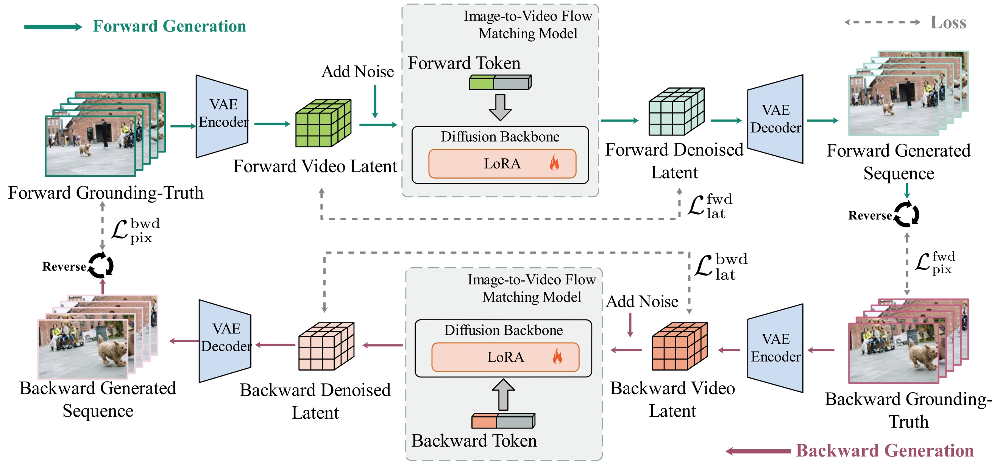

# Can Video Diffusion Models Predict Past Frames? Bidirectional Cycle Consistency for Reversible Interpolation

### Abstract

> Video frame interpolation aims to synthesize realistic intermediate frames between given endpoints while adhering to
> specific motion semantics. While recent generative models have improved visual fidelity, they predominantly operate in
> a
> unidirectional manner, lacking mechanisms to self-verify temporal consistency. This often leads to motion drift,
> directional ambiguity, and boundary misalignment, especially in long-range sequences. Inspired by the principle of
> temporal cycle-consistency in self-supervised learning, we propose a novel bidirectional framework that enforces
> symmetry between forward and backward generation trajectories. Our approach introduces learnable directional tokens to
> explicitly condition a shared backbone on temporal orientation, enabling the model to jointly optimize forward
> synthesis
> and backward reconstruction within a single unified architecture. This cycle-consistent supervision acts as a powerful
> regularizer, ensuring that generated motion paths are logically reversible. Furthermore, we employ a curriculum
> learning
> strategy that progressively trains the model from short to long sequences, stabilizing dynamics across varying
> durations. Crucially, our cyclic constraints are applied only during training; inference requires a single forward
> pass,
> maintaining the high efficiency of the base model. Extensive experiments show that our method achieves
> state-of-the-art
> performance in imaging quality, motion smoothness, and dynamic control on both 37-frame and 73-frame tasks,
> outperforming strong baselines while incurring no additional computational overhead.

### Comparisons
<video src="videos/video1.mp4" controls width="600"></video>
<video src="videos/video13.mp4" controls width="600"></video>

### Framework

A brief overview of our framework. During training, each ground-truth video is used to construct two samples. The
forward sample interpolates from the original start frame to the original end frame. The backward sample interpolates in
the reverse temporal direction, starting from the original end frame and ending at the original start frame. These two
directions are controlled by distinct learnable directional tokens. The model is supervised with reconstruction losses
in both latent space and pixel space for both directions, which encourages consistent motion modeling under time
reversal.